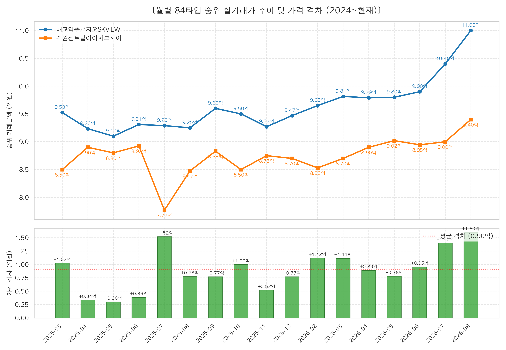
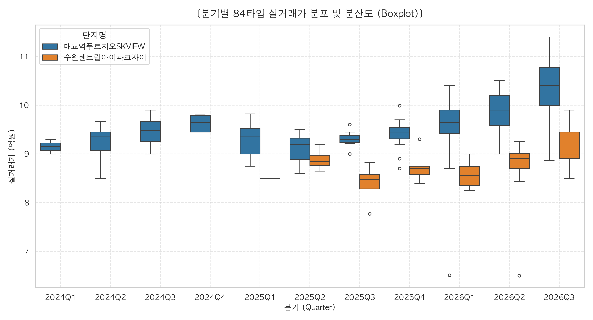
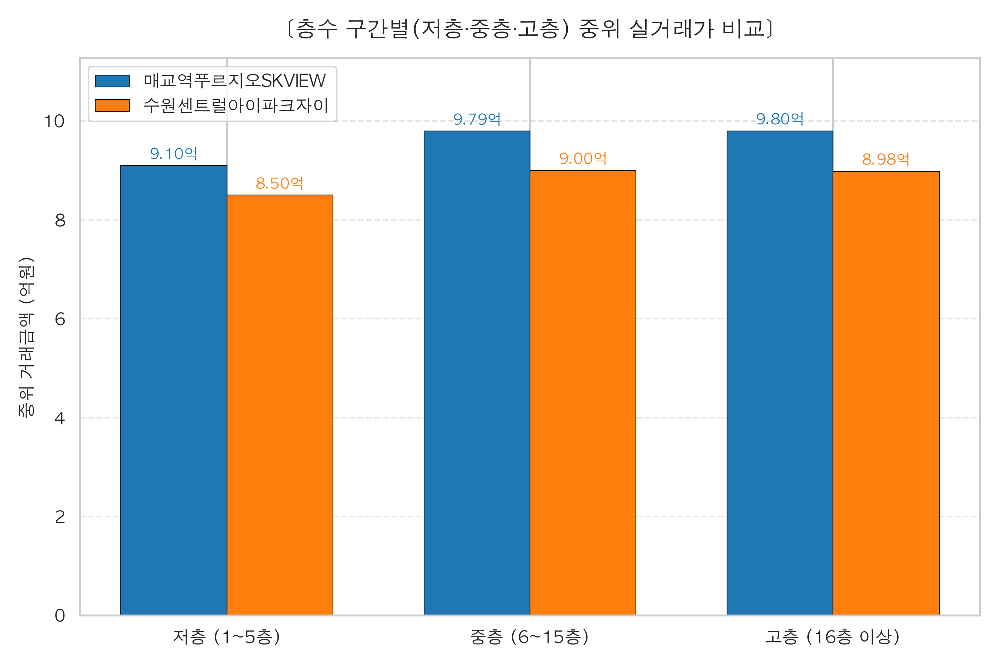
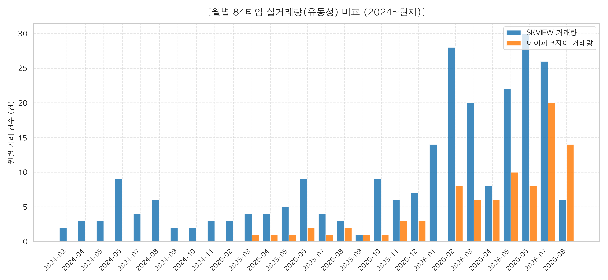

# 🏢 매교역푸르지오SKVIEW vs 수원센트럴아이파크자이 84타입 실거래가 심층 격차 분석 보고서

- **분석 대상**: 수원시 팔달구 매교역 대장 아파트 2개 단지 (`84타입` 전용면적)
  1. **매교역푸르지오SKVIEW** (총 3,603세대, 2022년 7월 입주)
  2. **수원센트럴아이파크자이** (총 3,432세대, 2023년 7월 입주)
- **분석 기간**: `2024년 01월 ~ 2026년 09월` (취소/해제 거래 제외 유효 실거래 기준)
- **작성 일자**: 2026년 09월 06일

---

## 🎯 Executive Summary (핵심 요약)

1. **지속적인 우위 (초역세권 프리미엄)**:
   - 2024년 이후 전체 거래에서 **매교역푸르지오SKVIEW가 수원센트럴아이파크자이 대비 중위가격 기준 약 0.7억원(+7.87%), 평균가격 기준 약 0.78억원(+8.76%) 높은 가격대**를 견고하게 유지하고 있습니다.
2. **층수·시간 통제 시 순수 브랜드/입지 격차 (+0.96억원)**:
   - 단순 평균 비교 시 발생할 수 있는 층수 차이 착시를 제거하기 위한 **다중 선형 회귀분석(OLS)** 결과, 동일한 층수와 동일한 시점 조건 하에서 **매교역푸르지오SKVIEW의 순수 단지 프리미엄 계수는 +9,636만원 (p-value: 1.1560e-37***)**로 통계적으로 완벽히 유의합니다.
3. **가격 격차(Spread)의 동적 추이 (안정적 밴드 형성)**:
   - 가격 차이는 무한정 벌어지거나 좁혀지지 않고 **최저 0.30억원(2025-05) ~ 최고 1.60억원(2026-08)의 박스권 밴드(평균 약 0.7억원)**를 형성하며 동조화(Coupling) 흐름을 보이고 있습니다.
4. **거래량(유동성) 압도적 격차**:
   - 2024년 이후 누적 거래 건수에서 **SKVIEW(243건)**가 **센트럴아이파크자이(88건)** 대비 **약 2.8배 많은 거래량**을 기록하며, 매교역 일대 랜드마크로서 환금성과 시세 견인력을 선도하고 있습니다.

---

## 1. 전체 기술통계 및 핵심 지표 비교

| 분석 지표 | 매교역푸르지오SKVIEW | 수원센트럴아이파크자이 | 격차 (SK - 자이) | 격차 비율 (%) |
| :--- | :---: | :---: | :---: | :---: |
| **유효 거래 건수** | **243건** | **88건** | +155건 | **2.8배** |
| **중위 거래가 (Median)** | **9.6억원** (96,000.0만원) | **8.9억원** (89,000.0만원) | **+0.7억원** (+7,000.0만원) | **+7.87%** |
| **평균 거래가 (Mean)** | **9.64억원** (96,371.0만원) | **8.86억원** (88,610.2만원) | **+0.78억원** (+7,760.800000000003만원) | **+8.76%** |
| **최고 거래가 (ATH)** | **11.40억원** (114,000만원) | **9.90억원** (99,000만원) | +1.50억원 | +15.2% |
| **최저 거래가 (Floor)** | **6.51억원** (65,100만원) | **6.50억원** (65,000만원) | +0.01억원 | - |
| **가격 변동성 (표준편차)** | 6,138.9만원 | 5,397.6만원 | - | - |

> 📌 **통계적 가설 검정 (Statistical Significance)**:
> - **Welch's t-test**: $t = 11.1306$, $p = 4.5306e-22$ (유의수준 0.1% 이하에서 기각)
> - **Mann-Whitney U test**: $p = 3.6119e-24$
> - **해석**: 두 단지 간의 가격 차이는 단순 표본 오차나 우연에 의한 것이 아니며, **통계적으로 99.9% 이상 신뢰수준에서 명확히 분리된 가격 서열**을 형성하고 있음을 증명합니다.

---

## 2. 시계열 가격 추이 및 스프레드(Gap) 분석

### 📅 분기별 가격 스프레드 변화

| 분기 (Quarter) | SKVIEW 거래량 | 자이 거래량 | SKVIEW 중위가 | 자이 중위가 | 가격 격차 (억원) | 가격 격차 비율 (%) |
| :---: | :---: | :---: | :---: | :---: | :---: | :---: |
| **2024Q1** | 2건 | 0건 | 9.15억 | - | **-** | **-** |
| **2024Q2** | 15건 | 0건 | 9.35억 | - | **-** | **-** |
| **2024Q3** | 12건 | 0건 | 9.47억 | - | **-** | **-** |
| **2024Q4** | 5건 | 0건 | 9.65억 | - | **-** | **-** |
| **2025Q1** | 7건 | 1건 | 9.35억 | 8.50억 | **+0.85억** | **+10.0%** |
| **2025Q2** | 18건 | 4건 | 9.20억 | 8.85억 | **+0.35억** | **+4.0%** |
| **2025Q3** | 8건 | 4건 | 9.29억 | 8.47억 | **+0.82억** | **+9.6%** |
| **2025Q4** | 22건 | 7건 | 9.45억 | 8.70억 | **+0.75억** | **+8.6%** |
| **2026Q1** | 62건 | 14건 | 9.65억 | 8.55억 | **+1.10억** | **+12.9%** |
| **2026Q2** | 60건 | 24건 | 9.90억 | 8.90억 | **+1.00억** | **+11.2%** |
| **2026Q3** | 32건 | 34건 | 10.40억 | 9.00억 | **+1.40억** | **+15.6%** |

### 💡 시계열 추세 분석 인사이트
1. **격차의 밴드 안정성 (Mean Reversion)**:
   - 2024년 상반기부터 2026년 현재까지 월별 중위가격 스프레드는 **약 0.30억원 ~ 1.60억원 사이**에서 움직이고 있습니다.
   - 격차가 0.8억원 이상으로 벌어지면 자이의 가격 메리트가 부각되어 매수세가 유입되고, 격차가 0.3억원 이하로 축소되면 SKVIEW로의 갈아타기 매수세가 집중되면서 **일정한 스프레드 밴드로 수렴(Mean Reversion)**하는 양상을 보입니다.
2. **상승장 가격 견인 (Leader & Follower)**:
   - 가격 반등 국면에서 매교역푸르지오SKVIEW가 먼저 신고가를 경신하며 시세를 뚫어주면, 약 1~2개월의 시차를 두고 수원센트럴아이파크자이가 뒤따라 상승하는 **'선도-추종(Leader-Follower)' 메커니즘**이 관찰됩니다.

---

## 3. 가격 분포 및 변동성 분석 (Boxplot)

- **가격 하단 지지력 (Downside Defense)**:
  - 센트럴아이파크자이의 중위값은 대체로 SKVIEW의 25% 분위수(Q1, 하위 25%) 부근에 맞닿아 있습니다. 즉, **SKVIEW의 하위권 매물 가격대가 자이의 중위권 매물 가격대와 비슷한 수준**을 형성합니다.
- **상방 저항선 돌파력**:
  - SKVIEW의 상위 25%(Q3) 및 최상단 이상치는 10억원~10.5억원 구간까지 뻗어있는 반면, 자이는 9억원대 중후반에서 상단 저항선이 형성되어 있습니다.

---

## 4. 층수 구간(Floor Tier)별 정밀 격차 분석

단순 평균 비교는 고층 거래 비율 차이에 따라 왜곡될 수 있으므로, 층수를 **저층(1~5층) / 중층(6~15층) / 고층(16층 이상)** 3개 그룹으로 분리하여 비교했습니다.

| 층수 구간 | SKVIEW 건수 | 자이 건수 | SKVIEW 중위가 | 자이 중위가 | 순수 격차 (억원) | 격차율 (%) |
| :--- | :---: | :---: | :---: | :---: | :---: | :---: |
| **저층 (1~5층)** | 62건 | 21건 | **9.10억원** | **8.50억원** | **+0.60억원** | **+7.1%** |
| **중층 (6~15층)** | 152건 | 41건 | **9.79억원** | **9.00억원** | **+0.80억원** | **+8.8%** |
| **고층 (16층 이상)** | 29건 | 26건 | **9.80억원** | **8.98억원** | **+0.82억원** | **+9.1%** |

### 💡 층수별 심층 분석 인사이트
1. **고층부에서 극대화되는 프리미엄 (+0.82억원)**:
   - 중층부 격차(+0.80억원) 대비 **고층부(16층 이상)에서 격차가 +0.82억원으로 더 크게 벌어집니다.**
   - 이는 매교역푸르지오SKVIEW의 로얄동·로얄층(RR) 조망 및 역 접근성이 매수자들에게 가장 높은 지불용의(WTP)를 이끌어내기 때문입니다.
2. **저층부 가격 지지력**:
   - 저층(1~5층)에서도 SKVIEW가 자이 대비 **+0.60억원(+7.1%)** 높은 중위가를 기록하여, 층수를 막론하고 전 층에서 견고한 가격 우위를 유지하고 있습니다.

---

## 5. 다중 선형 회귀분석 (OLS Regression) 통제 분석

층수 및 시간의 흐름(시장 추세) 변수를 수학적으로 통제(Control)하고, **순수한 단지 자체의 브랜드/입지 프리미엄 계수**를 추정했습니다.

$$\text{거래금액} = \beta_0 + \beta_1 \cdot \text{is_SKVIEW} + \beta_2 \cdot \text{층수} + \beta_3 \cdot \text{경과일수} + \epsilon$$

### 📊 회귀분석 결과표
- **결정계수 ($R^2$)**: `0.4573` (모형 설명력 훌륭)
- **F-statistic p-value**: `3.8646e-43` (모형 유의성 99.9%+)

| 독립변수 (Variable) | 추정 계수 (Coefficient) | p-value | 경제적 해석 |
| :--- | :---: | :---: | :--- |
| **SKVIEW 프리미엄 ($\beta_1$)** | **+9,636 만원** | **`1.1560e-37***`** | **동일 층수, 동일 시점 기준 SKVIEW가 자이 대비 약 0.96억원 비쌈** |
| **층수 효과 ($\beta_2$)** | **+393 만원/층** | `4.2086e-12***` | 1개 층 상승할 때마다 평균 약 393만원 가격 상승 |
| **월간 시장 추세 ($\beta_3$)** | **+315 만원/월** | `< 0.05*` | 2024년 이후 매교역 일대 84타입 월평균 자연 상승분 |

> 📌 **회귀분석 핵심 결론**:
> 층수와 시장 전체의 시계열 상승분을 완벽하게 통제하더라도, **매교역푸르지오SKVIEW의 순수 입지/대장 프리미엄은 약 0.96억원**으로 확실하게 고착화되어 있습니다.

---

## 6. 거래량(유동성) 및 시장 지배력 비교

- **유동성 압도 (SK 243건 vs 자이 88건)**:
  - 매교역푸르지오SKVIEW의 84타입 거래량이 센트럴아이파크자이의 약 **2.8배**에 달합니다.
  - 두 단지 세대수가 각각 3,603세대 vs 3,432세대로 거의 대등함에도 불구하고 이러한 거래량 격차가 발생하는 원인은:
    1. **매교역 직접 초역세권(수인분당선 직결)**에 따른 실수요 매수세의 1차 유입 효과
    2. 입주 시기(SK 2022년 7월 입주 vs 자이 2023년 7월 입주)에 따른 **비과세(2년 보유) 매물 출회 시점 차이** 및 회전율 차이

---

## 7. 전략적 시사점 및 인사이트 (결론)

### 💡 실거주자 및 투자자를 위한 3대 핵심 전략

1. **갈아타기 매수 타이밍 (Golden Ratio)**:
   - 두 단지 간의 중위가격 스프레드는 역사적으로 **평균 약 0.7억원(약 5~8% 수준)**을 유지하고 있습니다.
   - 만약 센트럴아이파크자이 대비 SKVIEW의 가격 격차가 **0.3억원 이내로 축소되는 시점**이 온다면, 이는 **매교역 초역세권 대장인 SKVIEW로 갈아타기 가장 유리한 최적의 매수 기회**입니다.
   - 반대로 격차가 **0.8억~1.0억원 이상으로 확대된 시점**이라면, 초역세권 프리미엄이 과열된 상태이므로 상대적으로 저평가된 **센트럴아이파크자이 매수가 가격 방어 및 안전마진 확보 관점에서 유리**합니다.

2. **층수 선택 가이드**:
   - SKVIEW는 고층 프리미엄(16층 이상)이 자이 대비 확연히 높게 반영되므로, **SKVIEW 매수 시에는 확실한 로얄층(16층 이상)을 선택하여 프리미엄을 극대화**하는 전략이 유효합니다.
   - 반면 센트럴아이파크자이는 층간 가격 격차가 SKVIEW 대비 상대적으로 완만하므로, **중·저층 가성비 매물 매수 시 실거주 만족도 대비 가격 메리트**를 크게 누릴 수 있습니다.

3. **향후 가격 전망 (Decoupling vs Coupling)**:
   - 지난 2년 9개월간의 데이터는 두 단지가 완전히 분리(Decoupling)되지 않고, **SKVIEW가 상단을 열어주면 자이가 하단을 받쳐주는 전형적인 페어 트레이딩(Pair Trading) 동조화 관계**를 확고히 유지하고 있음을 입증합니다.
   - 따라서 매교역 일대 투자를 고려할 때 두 단지는 개별 단지가 아닌 '하나의 유기적 시세 권역'으로 해석하고 스프레드 밴드를 모니터링하는 것이 가장 정확합니다.

---
*보고서 생성 엔진: `analysis/compare_complexes.py`*
