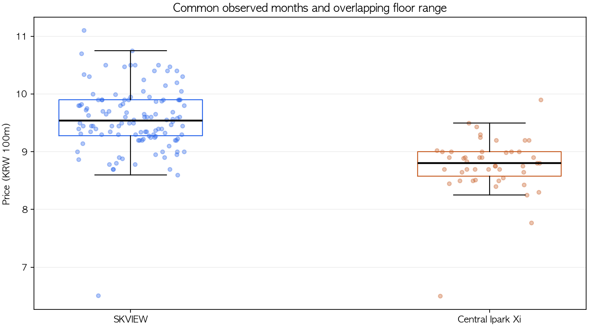
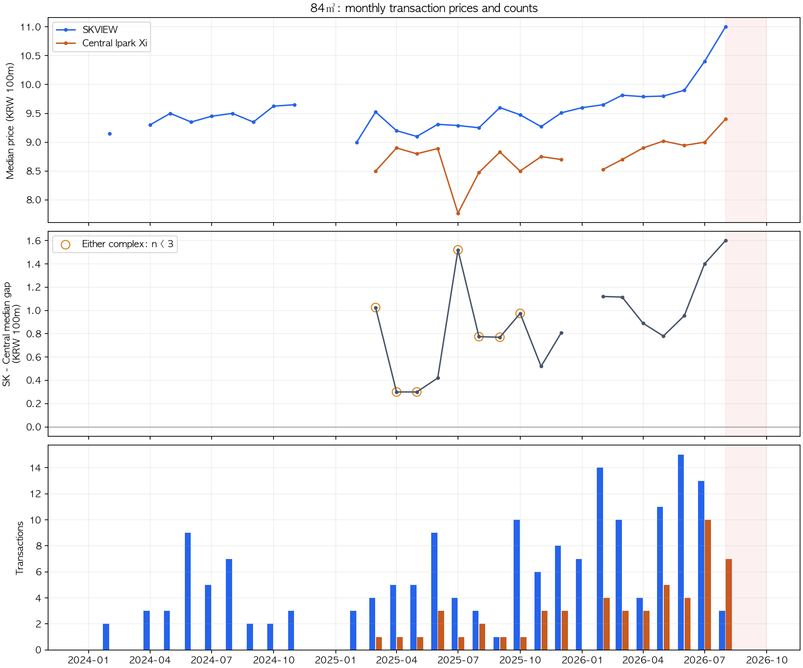
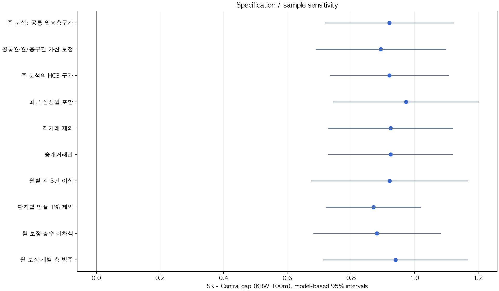

# 매교역푸르지오SKVIEW·수원센트럴아이파크자이 84㎡ 실거래 분석

같은 월·층구간에 양쪽 거래가 있는 표본의 SKVIEW−센트럴아이파크자이 평균가격 차이는 **+0.920억원**입니다(모형 기반 95% 구간 0.720~1.121억원). 관측된 비교 표본에서 SKVIEW가 더 높은 가격에 거래됐다는 근거가 있습니다.

평가의 핵심은 **거래가 집중된 가격대의 차이, 시기와 층 구성에 따른 변동, 관측 표본의 충분성**입니다. 가격 차이는 관측된 거래 특성을 반영한 값이며 개별 주택의 적정가격이나 향후 수익률을 뜻하지 않습니다.

## 1. 데이터 범위와 관측 여건

국토교통부 실거래가 공개 자료의 CSV 스냅샷에서 대상 기간·단지·면적에 해당하는 234행을 확인했습니다. 해제 행 10건과 유효 행의 중복 후보 0행을 제외하여 **224건**을 사용합니다. 가격 오류로 제외한 행은 0건입니다. 같은 공개 키에 해제 행과 유효 행이 함께 있는 경우 원본의 상태를 각각 보존하고 유효 행을 사용합니다.

계약일 범위는 **2024-01-01~2026-09-06**, 전용면적은 84.0㎡ 이상 85.0㎡ 미만입니다. 현재 확보한 스냅샷의 계약일을 제한한 것으로, 과거 시점의 신고 상태를 복원한 자료는 아닙니다. 최근 30일의 관측 지연을 고려하여 완충기간 시작일까지 종료된 달, 즉 **2026-07-31까지**를 주 분석에 사용합니다. 완충기간은 신고 완료를 보장하지 않습니다.

| 단지 | 유효 건수 | 첫 관측 계약일 | 마지막 관측 계약일 | 관측월 수 | 실제 면적(㎡) | 직거래 | 유형 미상/충돌 |
| --- | --- | --- | --- | --- | --- | --- | --- |
| 매교역푸르지오SKVIEW | 171 | 2024-02-04 | 2026-08-13 | 28 | 84.97 | 1 | 0 |
| 수원센트럴아이파크자이 | 53 | 2025-03-10 | 2026-08-29 | 17 | 84.99 | 1 | 0 |

두 단지에 거래가 함께 있는 달은 전체 범위에서 17개월입니다. 그중 한쪽이 3건 미만인 달은 7개월, 양쪽 각 5건 이상인 달은 2개월입니다. **거래 수가 적은 달의 중위가격은 소수 거래의 조건에 크게 좌우됩니다.** 관측 0건은 자료에 유효 거래가 없다는 뜻이며 실제 시장의 거래 부재나 수집 완전성을 보장하지 않습니다.

## 2. 가격 수준과 분포

두 단지 전체 유효 거래의 분포는 다음과 같습니다. 금액은 모두 억원이며, 중앙 50%는 25~75분위 구간입니다. 두 단지의 관측 기간과 월별 거래 비중이 달라 이 표만으로 같은 시점의 주택 가격을 비교할 수는 없습니다.

| 단지 | 건수 | 평균 | 중위 | 중앙 50% | 최저~최고 |
| --- | --- | --- | --- | --- | --- |
| 매교역푸르지오SKVIEW | 171 | 9.549 | 9.500 | 9.260~9.810 | 6.510~11.400 |
| 수원센트럴아이파크자이 | 53 | 8.832 | 8.830 | 8.650~9.000 | 6.500~9.900 |

가격 수준을 비교할 때는 **2025-03~2026-07의 공통 관측월 16개월, 1~19층**의 거래로 제한합니다. 공통 표본은 같은 관측월과 겹치는 층 범위를 사용하지만, 월·층별 거래 비중까지 같게 만든 표본은 아닙니다.

| 단지 | 공통 표본 건수 | 평균 | 중위 | 중앙 50% | 최저~최고 |
| --- | --- | --- | --- | --- | --- |
| 매교역푸르지오SKVIEW | 120 | 9.569 | 9.538 | 9.277~9.900 | 6.510~11.100 |
| 수원센트럴아이파크자이 | 46 | 8.772 | 8.800 | 8.575~9.000 | 6.500~9.900 |

공통 표본의 중위가격은 SKVIEW **9.538억원**, 센트럴아이파크자이 **8.800억원**으로, 차이는 0.738억원입니다. 평균 차이는 0.797억원입니다. SKVIEW의 중앙 50% 가격 구간 하단이 센트럴아이파크자이의 중앙 50% 구간 상단보다 높아, 거래가 집중된 가격대에도 차이가 나타납니다. 전체 최저~최고 범위는 겹치므로 개별 거래의 가격 순서가 항상 같다는 뜻은 아닙니다.



공통 표본에서 가장 낮은 거래의 조건은 다음과 같습니다. 최저가 하나를 단지의 대표 가격으로 해석하기보다 거래유형과 층을 함께 확인할 필요가 있습니다.

| 단지 | 계약일 | 층 | 가격(억) | 거래유형 |
| --- | --- | --- | --- | --- |
| 매교역푸르지오SKVIEW | 2026-02-14 | 12 | 6.51 | 직거래 |
| 수원센트럴아이파크자이 | 2026-04-21 | 5 | 6.50 | 중개거래 |

SKVIEW의 해당 월(2026-02) 공통 표본 14건의 평균은 9.32억원, 중위가격은 9.65억원입니다. 센트럴아이파크자이의 해당 월(2026-04) 공통 표본 3건의 평균은 8.10억원, 중위가격은 8.90억원입니다. 평균과 중위가격을 함께 보면 소수 저가 거래가 월별 대표가격에 미치는 영향을 확인할 수 있습니다.

낮은 가격만으로 오류나 특수관계인 거래라고 판단하지 않습니다. 직거래와 분포 양끝의 가격을 제외하는 민감도 분석을 별도로 제공합니다.

## 3. 시기별 가격과 거래 구성

아래 표는 공통 표본을 분기별로 집계한 것입니다. **표에 적힌 관측월만 포함**하므로 온전한 분기의 시장지수는 아닙니다. 거래 구성에 따라 중위가격이 달라질 수 있어 동일 주택의 가격 상승률로 해석하지 않습니다.

| 분기 | 포함된 관측월 | SK/센트럴 건수 | SK 중위(억) | 센트럴 중위(억) | 중위 차이(억) |
| --- | --- | --- | --- | --- | --- |
| 2025Q1 | 2025-03 | 4/1 | 9.525 | 8.500 | 1.025 |
| 2025Q2 | 2025-04, 2025-05, 2025-06 | 18/5 | 9.200 | 8.890 | 0.310 |
| 2025Q3 | 2025-07, 2025-08, 2025-09 | 8/4 | 9.290 | 8.475 | 0.815 |
| 2025Q4 | 2025-10, 2025-11, 2025-12 | 24/7 | 9.450 | 8.700 | 0.750 |
| 2026Q1 | 2026-02, 2026-03 | 24/7 | 9.725 | 8.550 | 1.175 |
| 2026Q2 | 2026-04, 2026-05, 2026-06 | 30/12 | 9.900 | 8.900 | 1.000 |
| 2026Q3 | 2026-07 | 12/10 | 10.370 | 9.000 | 1.370 |

최근 4개 분기 관측구간(2025Q4~2026Q3)의 중위가격은 SKVIEW가 **9.450 → 9.725 → 9.900 → 10.370억원**, 센트럴아이파크자이가 **8.700 → 8.550 → 8.900 → 9.000억원**입니다. 이 구간에서 SKVIEW의 관측 중위가격은 순차적으로 높아집니다. 이는 거래된 주택의 가격 분포 변화이며 같은 주택을 반복 관측한 결과는 아닙니다.

잠정월을 제외한 최근 공통 관측월 **2026-07**의 전 층 유효 거래는 SKVIEW 13건, 센트럴아이파크자이 10건입니다. 각 중위가격은 10.40억원과 9.00억원, 차이는 **1.40억원**입니다. 이 달에서 같은 층구간끼리 비교한 가중평균 차이는 **0.978억원**(SK 12건/센트럴 10건)입니다. 표본과 통계량이 다르므로 두 수치의 차이 전체를 층수 보정 효과로 해석할 수 없습니다. 월 중위가격의 차이가 커졌다는 사실만으로 같은 조건의 주택 간 격차도 확대됐다고 판단하기 어렵습니다.

잠정월 2026-08에는 SKVIEW 3건·센트럴아이파크자이 7건이 있으며, 중위가격 차이는 1.60억원입니다. 추가 신고와 해제 반영으로 표본이 바뀔 수 있어 주 분석과 분리해 표시합니다.



## 4. 층 구성과 같은 조건 구간의 가격 차이

공통 표본의 고층 거래 비중은 SKVIEW 10.0%, 센트럴아이파크자이 26.1%입니다. 거래된 층 구성이 다르므로 전체 평균만으로 단지 간 가격 차이를 평가하기에는 한계가 있습니다. 같은 층구간에도 실제 층·동·향·주택 상태의 차이가 남습니다.

아래 중위가격과 비중은 공통 표본 기준입니다. 마지막 열은 양쪽 거래가 있는 월×층구간만 남겨 구간별 평균 차이를 가중한 값입니다. 층구간마다 포함되는 월과 거래가 달라 마지막 열의 크기를 층수 자체의 효과로 비교해서는 안 됩니다.

| 층구간 | SK 건수(비중) | 센트럴 건수(비중) | SK 중위(억) | 센트럴 중위(억) | 매칭 SK/센트럴 건수 | 매칭 월 수 | 매칭 평균 차이(억) |
| --- | --- | --- | --- | --- | --- | --- | --- |
| 1–5층 | 30 (25.0%) | 10 (21.7%) | 9.000 | 8.475 | 15/10 | 7 | 0.772 |
| 6–15층 | 78 (65.0%) | 24 (52.2%) | 9.625 | 8.775 | 70/24 | 12 | 1.003 |
| 16층 이상 | 12 (10.0%) | 12 (26.1%) | 9.765 | 8.900 | 8/9 | 5 | 0.789 |

주 분석에는 공통 표본 166건 중 **136건(SKVIEW 93건·센트럴아이파크자이 43건), 24개 월×층구간, 15개월**을 사용했습니다. 각 구간의 평균 차이를 `n_SK × n_센트럴 / (n_SK + n_센트럴)`로 가중하며, 이는 `가격 ~ 단지 + C(월×층구간)` 회귀의 단지 계수와 같습니다.

같은 월·층구간에 양쪽 거래가 있는 표본의 SKVIEW−센트럴아이파크자이 평균가격 차이는 **+0.920억원**입니다(모형 기반 95% 구간 0.720~1.121억원). 관측된 비교 표본에서 SKVIEW가 더 높은 가격에 거래됐다는 근거가 있습니다.

구간별 평균 차이가 양수인 구간은 24개, 음수인 구간은 0개입니다. 다만 13개 구간은 한쪽 거래가 1건뿐이고, 양쪽 각 3건 이상인 구간은 4개입니다. 구간들이 같은 월의 시장 여건을 공유하므로 이 건수를 독립적인 반복 검증 횟수로 볼 수 없습니다. **세부 월·층구간의 작은 표본 때문에 개별 구간의 가격 차이 크기는 신중하게 해석해야 합니다.**

## 5. 거래 선택과 모형에 따른 민감도

계산 가능한 원화 모형들의 점추정은 0.871~0.973억원입니다. 검토한 조건에서는 SKVIEW가 더 높은 가격에 거래되는 방향이 유지됩니다. 이 범위는 민감도 범위이며 신뢰구간이 아닙니다.

| 조건 | SK/센트럴 건수 | 월 수 | 추정 차이 | 95% 구간 | 단위 | 상태 |
| --- | --- | --- | --- | --- | --- | --- |
| 주 분석: 공통 월×층구간 | 93/43 | 15 | 0.920 | 0.720~1.121 | 억원 | 산출 |
| 공통월·월/층구간 가산 보정 | 120/46 | 16 | 0.893 | 0.690~1.097 | 억원 | 산출 |
| 주 분석의 HC3 구간 | 93/43 | 15 | 0.920 | 0.735~1.106 | 억원 | 산출 |
| 최근 잠정월 포함 | 96/47 | 16 | 0.973 | 0.745~1.200 | 억원 | 산출 |
| 직거래 제외 | 88/42 | 14 | 0.924 | 0.729~1.120 | 억원 | 산출 |
| 중개거래만 | 88/42 | 14 | 0.924 | 0.729~1.120 | 억원 | 산출 |
| 월별 각 3건 이상 | 77/36 | 9 | 0.922 | 0.676~1.168 | 억원 | 산출 |
| 월별 각 5건 이상 | 23/15 | 2 | 0.930 | —~— | 억원 | 점추정만: 월 군집 6개 미만 |
| 단지별 양끝 1% 제외 | 88/41 | 14 | 0.871 | 0.723~1.018 | 억원 | 산출 |
| 월 보정·층수 이차식 | 120/46 | 16 | 0.882 | 0.683~1.081 | 억원 | 산출 |
| 월 보정·개별 층 범주 | 120/46 | 16 | 0.940 | 0.714~1.166 | 억원 | 산출 |
| 로그가격: 같은 월×층구간 | 93/43 | 15 | 10.534 | 7.934~13.196 | % | 산출 |

한 달씩 제외한 주 분석의 추정 범위는 **0.866~0.954억원**입니다. 특정 관측월 하나가 전체 결과에 미치는 영향을 점검한 값이며 신뢰구간은 아닙니다. 월별 각 3/5건 기준은 공통 층 범위로 제한한 뒤 월×층구간 매칭 전에 적용합니다. 단지별 양끝 1% 제외는 공통 표본의 가격 분위수를 사용한 민감도 확인이며 자동 오류 정제가 아닙니다.



## 6. 데이터에 대한 종합 평가

- **대표 가격대:** 계산 가능한 원화 모형들의 점추정은 0.871~0.973억원입니다. 검토한 조건에서는 SKVIEW가 더 높은 가격에 거래되는 방향이 유지됩니다. 이 범위는 민감도 범위이며 신뢰구간이 아닙니다.
- **시기별 변화:** 분기별 표본의 중위가격은 거래가 집중된 가격대의 이동을 보여줍니다. 거래 주택과 층 구성이 달라 월 중위가격의 차이가 움직인 만큼 같은 조건 주택의 차이도 움직였다고 볼 수는 없습니다.
- **세부 구간의 정밀도:** 매칭 구간 24개 중 13개는 한쪽 거래가 1건입니다. 전체 표본의 가격 차이를 특정 동·층에 그대로 적용하기에는 관측이 부족합니다.
- **거래 활동:** 관측 거래 수와 그 증감은 확인할 수 있습니다. 84㎡ 세대수, 매물 수, 매각 소요기간이 없어 회전율이나 매도 용이성을 계산할 수는 없습니다.

단지마다 전용면적이 한 값뿐이므로 면적 효과와 단지 효과를 따로 식별할 수 없습니다. 동·향·조망·수리상태·세부 평면·매도 사유는 분석에서 보정하지 못했습니다. 따라서 관측된 가격 차이의 원인을 입지나 브랜드로 분리하거나, 향후 가격 차이와 투자 수익을 예측하는 데에는 추가 자료가 필요합니다.

## 7. 산출 기준과 재현

공개 거래키는 계약일·지역코드·법정동·지번·단지·층·전용면적·금액으로 구성합니다. 동·호/계약 고유번호가 충분하지 않아 동일 조건의 서로 다른 실제 거래를 완전히 구분할 수는 없습니다. 원자료의 행 번호와 제공되는 동·등기일 정보는 보존합니다.

95% 구간은 월 안의 오차 의존을 허용한 군집 표준오차, 소표본 보정, 월 수−1 자유도의 t 분포로 계산했습니다. 월 군집이 6개 미만이면 구간을 생략합니다. 이 최소 조건도 충분한 정밀도를 보장하지 않으며 월 간 자기상관·거래 선택 편향·누락 변수는 구간에 반영되지 않습니다. HC3는 거래별 독립성을 더 강하게 가정한 보조 구간입니다. 구현은 [statsmodels 공식 문서](https://www.statsmodels.org/dev/generated/statsmodels.regression.linear_model.OLSResults.get_robustcov_results.html)를 따릅니다.

로그가격의 결과는 `100 × (exp(계수)−1)`로 환산한 조건부 기하평균 가격 차이(%)입니다. 개별 거래의 수익률이나 산술평균 가격 차이와는 다릅니다.

```bash
conda run -n py312 python analysis/compare_complexes_reassessment.py --as-of 2026-09-06 --start-date 2024-01-01 --lag-days 30 --source csv
```

[유효 거래](cleaned_transactions.csv), [가격 분포](price_distributions.csv), [분기별 관측](quarterly.csv), [층별 구성](floor_summary.csv), [월×층구간](matched_cells.csv), [월별 매칭 집계](matched_monthly.csv), [민감도 수치](model_comparison.csv), [한 달씩 제외한 결과](leave_one_month_out.csv), [설정·감사·원자료 해시](results.json)에서 수치를 확인할 수 있습니다. 실행 Python은 3.12.8입니다.

## 부록. 월별 전 층 유효 거래

월별 표는 전체 유효 거래를 사용합니다. 희소 표시는 한쪽 3건 미만, 잠정 표시는 주 분석의 관측 완충기간 때문에 제외한 월입니다. 거래가 없는 달의 가격과 차이는 결측으로 남깁니다.

| 월 | SK/센트럴 건수 | SK 중위(억) | 센트럴 중위(억) | 중위 차이(억) | 주의 |
| --- | --- | --- | --- | --- | --- |
| 2024-01 | 0/0 | — | — | — | 희소 |
| 2024-02 | 2/0 | 9.15 | — | — | 희소 |
| 2024-03 | 0/0 | — | — | — | 희소 |
| 2024-04 | 3/0 | 9.30 | — | — | 희소 |
| 2024-05 | 3/0 | 9.50 | — | — | 희소 |
| 2024-06 | 9/0 | 9.35 | — | — | 희소 |
| 2024-07 | 5/0 | 9.45 | — | — | 희소 |
| 2024-08 | 7/0 | 9.50 | — | — | 희소 |
| 2024-09 | 2/0 | 9.35 | — | — | 희소 |
| 2024-10 | 2/0 | 9.62 | — | — | 희소 |
| 2024-11 | 3/0 | 9.65 | — | — | 희소 |
| 2024-12 | 0/0 | — | — | — | 희소 |
| 2025-01 | 0/0 | — | — | — | 희소 |
| 2025-02 | 3/0 | 9.00 | — | — | 희소 |
| 2025-03 | 4/1 | 9.53 | 8.50 | 1.03 | 희소 |
| 2025-04 | 5/1 | 9.20 | 8.90 | 0.30 | 희소 |
| 2025-05 | 5/1 | 9.10 | 8.80 | 0.30 | 희소 |
| 2025-06 | 9/3 | 9.31 | 8.89 | 0.42 |  |
| 2025-07 | 4/1 | 9.29 | 7.77 | 1.52 | 희소 |
| 2025-08 | 3/2 | 9.25 | 8.47 | 0.78 | 희소 |
| 2025-09 | 1/1 | 9.60 | 8.83 | 0.77 | 희소 |
| 2025-10 | 10/1 | 9.47 | 8.50 | 0.97 | 희소 |
| 2025-11 | 6/3 | 9.27 | 8.75 | 0.52 |  |
| 2025-12 | 8/3 | 9.51 | 8.70 | 0.81 |  |
| 2026-01 | 7/0 | 9.60 | — | — | 희소 |
| 2026-02 | 14/4 | 9.65 | 8.53 | 1.12 |  |
| 2026-03 | 10/3 | 9.82 | 8.70 | 1.12 |  |
| 2026-04 | 4/3 | 9.79 | 8.90 | 0.89 |  |
| 2026-05 | 11/5 | 9.80 | 9.02 | 0.78 |  |
| 2026-06 | 15/4 | 9.90 | 8.95 | 0.96 |  |
| 2026-07 | 13/10 | 10.40 | 9.00 | 1.40 |  |
| 2026-08 | 3/7 | 11.00 | 9.40 | 1.60 | 잠정 |
| 2026-09 | 0/0 | — | — | — | 잠정 |
